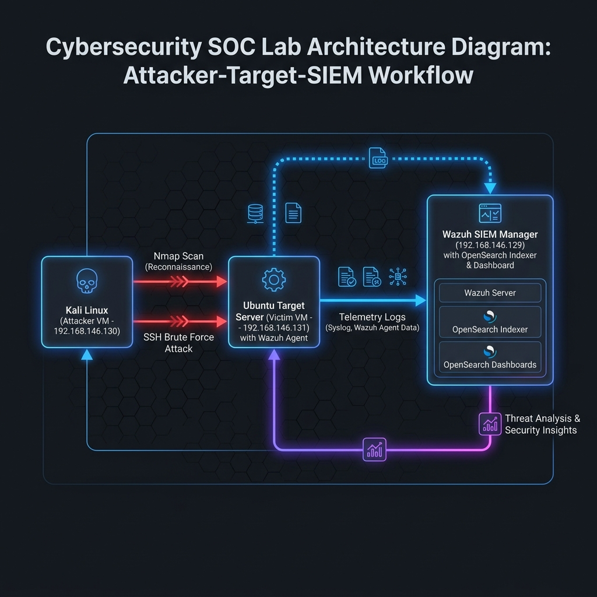
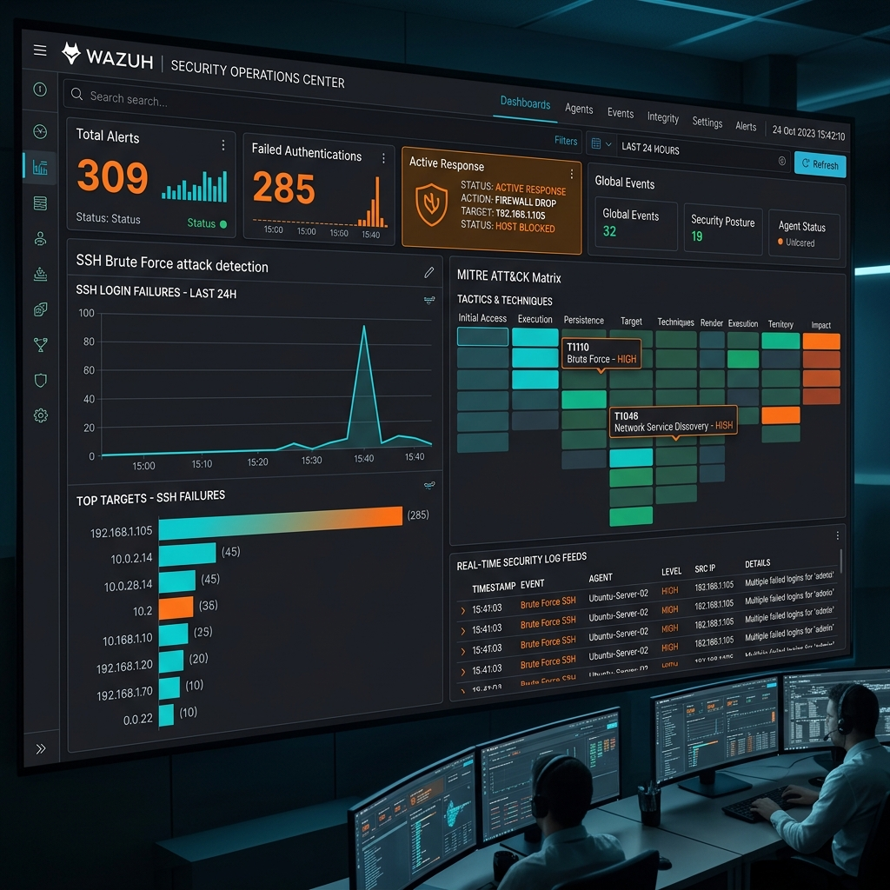

# 🛡️ SOC Lab — Detection SIEM (Wazuh), Analyse d'Incidents & Réponse Automatisée (Blue Team)


---

## 📌 Aperçu du Projet

Ce dépôt contient un guide complet et la documentation technique d'un **Security Operations Center (SOC) Lab** entièrement virtualisé. Ce lab simule le rôle d'un analyste **Blue Team** en charge de :
1. **Déployer une infrastructure de surveillance SIEM/XDR** basée sur **Wazuh**.
2. **Simuler un scénario d'attaque réel (Red Team)** : Reconnaissance réseau (`Nmap`) et attaque par dictionnaire/force brute SSH (`Hydra`).
3. **Collecter et analyser la télémétrie en temps réel** (`auth.log`, alertes SIEM).
4. **Qualifier l'incident** selon la méthodologie **MITRE ATT&CK** et produire les **IOCs**.
5. **Activer la réponse automatisée** (*Active Response*) pour bloquer l'attaquant au niveau pare-feu (`firewall-drop`).

---

## 📐 Architecture du Lab & Topologie Réseau

L'environnement repose sur **VMware Workstation / VirtualBox** configuré sous un sous-réseau NAT isolé (`192.168.146.0/24`).



### 🖥️ Inventaire des Machines Virtuelles

| Machine | OS | Rôle | Adresse IP | Composants / Outils |
| :--- | :--- | :--- | :--- | :--- |
| **Wazuh Server** | Ubuntu Server 22.04 | **SIEM / SOC Central** | `192.168.146.129` | Wazuh Manager, Indexer, OpenSearch Dashboard |
| **Ubuntu Target** | Ubuntu 22.04 LTS | **Cible (Victime)** | `192.168.146.131` | Agent Wazuh v4.7.0, Service SSH (Port 22) |
| **Kali Linux** | Kali Linux 2025.4 | **Attaquant (Red Team)** | `192.168.146.130` | Nmap, Hydra, Dictionnaire `rockyou.txt` |

---

## 💻 Guide de Reproduction Étape par Étape

Pour reproduire ce lab de A à Z sur votre propre machine, suivez les sections ci-dessous.

### 🛠️ Prérequis
* Un hyperviseur : **VMware Workstation Pro / Player** ou **VirtualBox**.
* Ressources système recommandées :
  * RAM : 16 Go au total (4 Go pour Wazuh Server, 2 Go pour Ubuntu Target, 2 Go pour Kali).
  * Espace Disque : ~40 Go d'espace libre.

---

### 1️⃣ Étape 1 : Configuration du Réseau Virtualisé (VMware NAT)
1. Ouvrez l'éditeur de réseau virtuel (**Virtual Network Editor**) dans VMware.
2. Créez/configurez un réseau **NAT (ex: VMnet8)** avec la plage IP : `192.168.146.0/24`.
3. Attribuez des adresses IP statiques ou réservées DHCP à vos 3 machines virtuelles.

---

### 2️⃣ Étape 2 : Déploiement de Wazuh SIEM Manager (Serveur)
Sur la VM **Wazuh Server** (`192.168.146.129`) :

```bash
# Mettre à jour le système
sudo apt update && sudo apt upgrade -y

# Télécharger et exécuter l'assistant d'installation automatisé de Wazuh
curl -sO https://packages.wazuh.com/4.x/wazuh-install.sh
curl -sO https://packages.wazuh.com/4.x/config.yml

# Lancer l'installation des composants (Manager, Indexer, Dashboard)
sudo bash wazuh-install.sh --all-in-one

# Une fois l'installation terminée, notez les identifiants admin générés
# Accédez au dashboard via navigateur : https://192.168.146.129
```

---

### 3️⃣ Étape 3 : Installation & Connexion de l'Agent Wazuh sur la Cible
Sur la VM **Ubuntu Target** (`192.168.146.131`) :

```bash
# 1. Télécharger le paquet d'installation de l'agent en spécifiant l'IP du serveur Wazuh
wget https://packages.wazuh.com/4.x/apt/pool/main/w/wazuh-agent/wazuh-agent_4.7.0-1_amd64.deb
sudo WAZUH_MANAGER='192.168.146.129' dpkg -i ./wazuh-agent_4.7.0-1_amd64.deb

# 2. Activer et démarrer le service agent
sudo systemctl daemon-reload
sudo systemctl enable wazuh-agent
sudo systemctl start wazuh-agent

# 3. Vérifier le statut de la connexion
sudo systemctl status wazuh-agent
```

* **Vérification** : Dans le Dashboard Wazuh, rendez-vous dans `Endpoints Summary` pour confirmer que l'agent est à l'état **Active**.

---

### 4️⃣ Étape 4 : Simulation de l'Attaque depuis Kali Linux (Red Team)

Depuis la VM **Kali Linux** (`192.168.146.130`) :

#### Phase 4.1 — Reconnaissance Réseau avec Nmap
```bash
# Scan complet des ports, détection de version (-sV) et scripts par défaut (-sC)
nmap -sV -sC -A 192.168.146.131
```
> **Résultat attendu :** Nmap identifie le port `22/tcp` ouvert exécutant `OpenSSH`.

#### Phase 4.2 — Attaque par Force Brute SSH avec Hydra
```bash
# Attaque par dictionnaire ciblée sur l'utilisateur 'root'
hydra -l root -P /usr/share/wordlists/rockyou.txt ssh://192.168.146.131 -t 4 -V
```
* `-l root` : Cible l'utilisateur privilégié.
* `-P /usr/share/wordlists/rockyou.txt` : Dictionnaire de mots de passe courants.
* `-t 4` : 4 threads parallèles pour générer un volume élevé de requêtes.
* `-V` : Mode verbeux pour afficher chaque tentative d'authentification.

---

### 5️⃣ Étape 5 : Analyse des Logs & Détection SIEM (Blue Team)



#### 📄 Télémétrie brute collectée sur la victime (`/var/log/auth.log`)
Les tentatives automatisées génèrent une rafale d'échecs d'authentification avec rotation rapide des ports éphémères :

```text
May 17 18:31:03 victim sshd[2927]: Failed password for root from 192.168.146.130 port 40444 ssh2
May 17 18:31:03 victim sshd[2930]: Failed password for root from 192.168.146.130 port 40468 ssh2
May 17 18:31:03 victim sshd[2929]: Failed password for root from 192.168.146.130 port 40450 ssh2
May 17 18:31:06 victim sshd[2928]: Failed password for root from 192.168.146.130 port 40462 ssh2
```

#### 📊 Métriques Générales de l'Incident (`INC-2026-001`)

* **Durée de l'attaque :** ~1 heure 51 minutes (18:31:03 – 20:22:15)
* **Volume d'alertes générées :** `309`
* **Échecs d'authentification :** `285`
* **Authentifications réussies :** `3` *(accès d'administration légitimes hors attaque)*
* **Taux de compromission :** **`0%` (Attaque contenue, 0 accès frauduleux)**

#### 🚨 Règles SIEM Wazuh Déclenchées

| Rule ID | Niveau | Description Wazuh | Groupe | MITRE ATT&CK |
| :---: | :---: | :--- | :--- | :---: |
| **5760** | 5 | `sshd: authentication failed` | `authentication_failed` | `T1110.001`, `T1021.004` |
| **5763** | 10 | `sshd: brute force trying to get access` | `authentication_failures` | `T1110` |
| **5503** | 5 | `PAM: User login failed` | `authentication_failed` | `T1110.001` |
| **5758** | 8 | `Maximum authentication attempts exceeded` | `authentication_failures` | `T1110` |
| **5551** | 10 | `PAM: Multiple failed logins in a small period` | `authentication_failures` | `T1110` |
| **40111** | 10 | `Multiple authentication failures` | `authentication_failures` | `T1110` |
| **651** | 3 | `Host Blocked by firewall-drop Active Response` | `active-response` | — |
| **652** | 3 | `Host Unblocked by firewall-drop Active Response` | `active-response` | — |

---

## 🎯 Mapping MITRE ATT&CK

| Tactique | ID Technique | Technique / Sous-technique | Application dans le Lab |
| :--- | :--- | :--- | :--- |
| **Reconnaissance** | `T1046` | Network Service Discovery | Exploration de la cible via Nmap (Port 22/tcp) |
| **Credential Access** | `T1110` | Brute Force | Attaque globale par force brute |
| **Credential Access** | `T1110.001` | Password Guessing | Attaque par dictionnaire Hydra avec `rockyou.txt` |
| **Lateral Movement** | `T1021.004` | Remote Services: SSH | Tentative de prise de contrôle à distance via SSH |
| **Defense Evasion** | `T1078` | Valid Accounts | Obtenir des identifiants `root` valides |

---

## 🔍 Indicateurs de Compromission (IOCs)

| Type d'IOC | Valeur | Description & Contexte |
| :--- | :--- | :--- |
| **IP Attaquante** | `192.168.146.130` | Adresse source de la machine Kali Linux |
| **Ports Source** | Ports éphémères (`40444+`) | Dynamic port binding généré par Hydra |
| **Compte Cible** | `root` | Identifiant ciblé lors des 285 tentatives |
| **User-Agent SSH** | `libssh` / `Hydra` | En-tête identifiable dans les logs `sshd` |
| **Comportement** | 285 échecs en ~1h51 | Trafic automatisé haute fréquence |

---

## ⚡ Réponse Automatisée & Sécurisation (Hardening)

### 🛡️ Active Response (Wazuh)
Lors de la détection de la règle `5763` (niveau 10), le script **Active Response** `firewall-drop` a été déclenché sur la cible, insérant automatiquement une règle `iptables` pour bloquer le trafic provenant de `192.168.146.130`.

### 🔐 Recommandations de Hardening du Service SSH

Pour protéger définitivement le serveur contre les attaques par force brute :

1. **Désactiver l'authentification par mot de passe** (`/etc/ssh/sshd_config`) :
   ```ini
   PasswordAuthentication no
   PubkeyAuthentication yes
   ```
2. **Interdire la connexion directe du compte Root** :
   ```ini
   PermitRootLogin no
   ```
3. **Restreindre les accès par IP avec UFW** :
   ```bash
   sudo ufw default deny incoming
   sudo ufw allow from <IP_ADMIN_CONFIANCE> to any port 22
   sudo ufw enable
   ```
4. **Configurer Fail2Ban** :
   Bannir toute IP générant plus de 5 échecs en moins de 60 secondes.
5. **Basculer vers un port SSH non standard** (ex: `2222`).

---

## 📜 Commandes Utiles pour l'Analyste SOC

```bash
# 1. Vérification des agents actifs côté Manager
sudo /var/ossec/bin/agent_control -la

# 2. Comptage du nombre d'échecs SSH dans auth.log
sudo grep "Failed password" /var/log/auth.log | wc -l

# 3. Filtrage en temps réel des alertes de niveau >= 10 dans Wazuh
sudo cat /var/ossec/logs/alerts/alerts.json | python3 -c "
import sys, json
for line in sys.stdin:
    alert = json.loads(line)
    if alert.get('rule', {}).get('level', 0) >= 10:
        print(f\"[{alert.get('timestamp')}] Rule {alert['rule']['id']} ({alert['rule']['level']}): {alert['rule']['description']}\")
"
```

---

## 🤝 Contribution & License

Les contributions sont les bienvenues ! N'hésitez pas à ouvrir une *Issue* ou une *Pull Request* pour améliorer les règles de détection ou ajouter de nouveaux scénarios d'attaque.

* **Licence :** MIT License
